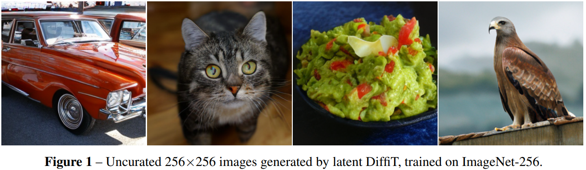

# DiffiT: Diffusion Vision Transformers for Image Generation

[Ali Hatamizadeh](https://research.nvidia.com/person/ali-hatamizadeh),
[Jiaming Song](https://tsong.me/),
[Guilin Liu](https://liuguilin1225.github.io/),
[Jan Kautz](https://jankautz.com/), 
[Arash Vahdat](https://research.nvidia.com/person/arash-vahdat).

Diffusion models with their powerful expressivity and high sample quality have enabled many new applications and use-cases in various domains. For sample generation, these models rely on a denoising neural network that generates images by iterative denoising. Yet, the role of denoising network architecture is not well-studied with most efforts relying on convolutional residual U-Nets. In this paper, we study the effectiveness of vision transformers in diffusion-based generative learning. Specifically, we propose a new model, denoted as Diffusion Vision Transformers (DiffiT), which consists of a hybrid hierarchical architecture with a U-shaped encoder and decoder. We introduce a novel window-based time-dependent self-attention module that allows attention layers to adapt their behavior at different stages of the denoising process in an efficient manner. We also introduce latent DiffiT which consists of transformer model with the proposed self-attention layers, for high-resolution image generation. Our results show that DiffiT is surprisingly effective in generating high-fidelity images. DiffiT achieves state-of-the-art (SOTA) performance in terms of FID score on a variety of class-conditional and unconditional synthesis tasks in both latent and image space experiments.

# Results 

## Performance on ImageNet-256

| Model| Dataset |  Resolution | FID-50K | Inception Score |
|---------|----------|-----------|---------|--------|
|DiffiT | ImageNet | 256x256   | 1.73    | 276.49|

## Performance on ImageNet-512

| Model| Dataset |  Resolution | FID-50K | Inception Score |
|---------|----------|-----------|---------|--------|
|DiffiT | ImageNet | 512x512   | 2.67    | 252.12|
