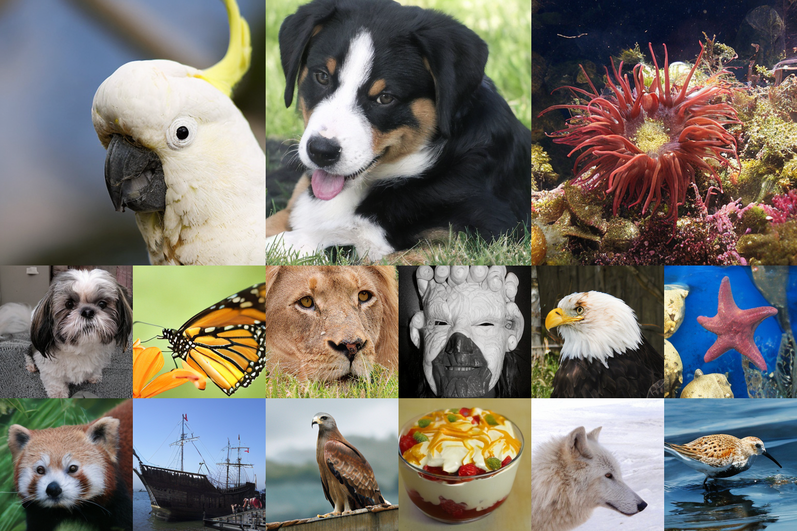
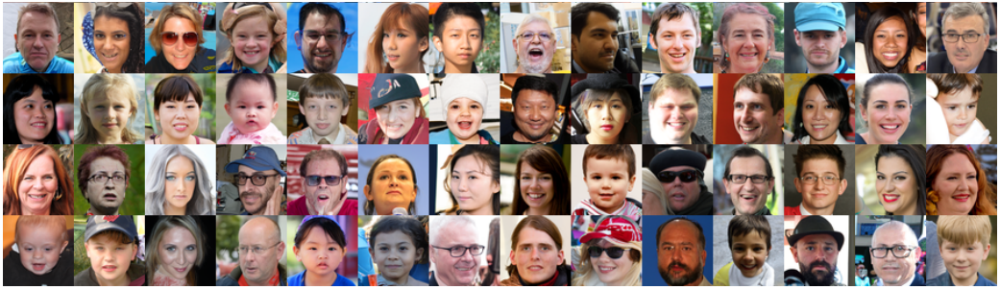
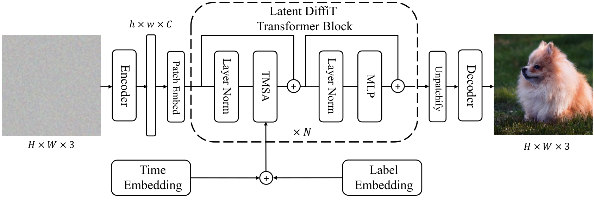

# DiffiT: Diffusion Vision Transformers for Image Generation

Official PyTorch implementation of [**DiffiT: Diffusion Vision Transformers for Image Generation**](https://arxiv.org/abs/2312.02139).


**Code and pretrained DiffiT models will be released soon !**  

[](https://github.com/NVlabs/DiffiT/stargazers)

**DiffiT** achieves a new SOTA FID score of **1.73** on **ImageNet-256 dataset** ! 




In addition, **DiffiT** sets a new SOTA FID score of **2.22** on **FFHQ-64 dataset** ! 



We introduce a new Time-dependent Multihead Self-Attention (TMSA) mechanism that jointly learns **spatial** and **temporal** dependencies and allows for **attention conditioning** with finegrained control. 




## 💥 News 💥
- **[12.04.2023]** 🔥 DiffiT [manuscript](https://arxiv.org/abs/2312.02139) is now available on arXiv !


# Benchmarks 

## Latent Space


### ImageNet-256

| Model| Dataset |  Resolution | FID-50K | Inception Score |
|---------|----------|-----------|---------|--------|
|**Latent DiffiT** | ImageNet | 256x256   | **1.73**    | **276.49**|

### ImageNet-512

| Model| Dataset |  Resolution | FID-50K | Inception Score |
|---------|----------|-----------|---------|--------|
|**Latent DiffiT** | ImageNet | 512x512   | **2.67**    | **252.12**|


## Image Space


| Model| Dataset |  Resolution | FID-50K | 
|---------|----------|-----------|---------|
|**DiffiT** | CIFAR-10 | 32x32   | **1.95** |
|**DiffiT** | FFHQ-64 | 64x64   | **2.22** |

## Citation

```
@article{hatamizadeh2023diffit,
  title={Diffit: Diffusion vision transformers for image generation},
  author={Hatamizadeh, Ali and Song, Jiaming and Liu, Guilin and Kautz, Jan and Vahdat, Arash},
  journal={arXiv preprint arXiv:2312.02139},
  year={2023}
}
```

## Licenses

Copyright © 2024, NVIDIA Corporation. All rights reserved.
